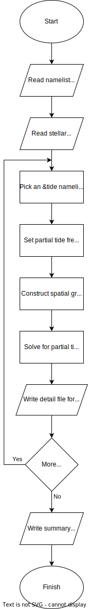

.. _frontends-gyre_tides:

gyre_tides
==========

The :program:`gyre_tides` frontend calculates the response of
a stellar model to tidal forcing by a orbiting point-mass
companion. The general flow of execution is outlined in the chart to
the right. After reading the :ref:`namelist input file
<namelist-input-files>` and the :ref:`model <stellar-models>`,
:program:`gyre_tides` loops over :nml_g:`tide` namelist groups,
processing each in turn.

For a given group, :program:`gyre_tides` solves for the response of
the star to the superposition of partial tidal potentials
:math:`\PhiTlmk` (see the :ref:`osc-tidal` section). The response
wavefunctions and other data associated with an individual partial
potential are optionally written to a :ref:`detail file
<detail-files>`.  At the end of the run, response data from all
partial potentials (across all :nml_g:`tide` groups) are optionally
written to a :ref:`summary file <summary-files>`.

The table below lists which namelist groups, and in what number,
should appear in namelist input files for :program:`gyre_tides`.

.. list-table::
   :header-rows: 1
   :widths: 30 30 20

   * - Description
     - Namelist group name
     - Number
   * - :ref:`constants`
     - :nml_g:`constants`
     - 1
   * - :ref:`grid-params`
     - :nml_g:`grid`
     - :math:`\geq 1`\ [#last]_
   * - :ref:`model-params`
     - :nml_g:`model`
     - 1
   * - :ref:`num-params`
     - :nml_g:`num`
     - :math:`\geq 1`\ [#last]_
   * - :ref:`orbit-params`
     - :nml_g:`orbit`
     - :math:`\geq 1`\ [#last]_
   * - :ref:`osc-params`
     - :nml_g:`osc`
     - :math:`\geq 1`\ [#last]_
   * - :ref:`output-params`
     - :nml_g:`tides_output`
     - 1
   * - :ref:`rot-params`
     - :nml_g:`rot`
     - :math:`\geq 1`\ [#last]_
   * - :ref:`tidal-params`
     - :nml_g:`tide`
     - :math:`\geq 1`
       
.. rubric:: Footnotes

.. [#last] While the input file can contain one or more of the
           indicated namelist group, only the last (:ref:`tag-matching
           <working-with-tags>`) one is used.
