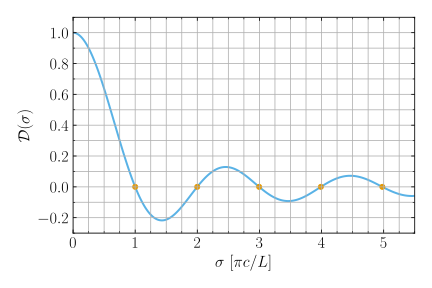
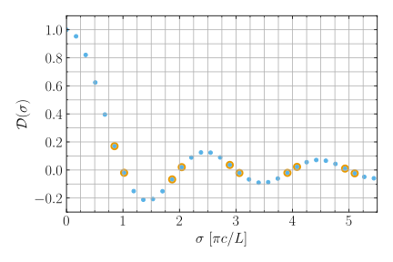
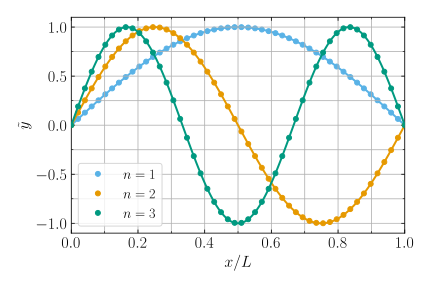

Numerical Solution
==================

Now let's see how we might go about solving the :ref:`stretched-string
BVP <stretched-string>` numerically, using an approach very similar to
the one implemented in GYRE's for solving the oscillation equations.

Separation
----------

We begin by performing a separation of variables on the wave equation,
assuming trial solutions of the form

.. math::

   y(x,t) = \tilde{y}(x) \exp (-\ii \sigma t),

where :math:`\tilde{y}(x)` is some function of :math:`x` alone. Then,
the wave equation reduces to an ordinary differential equation (ODE)
for :math:`\tilde{y}`,

.. math::

   \deriv{\tilde{y}}{x}{2} = \frac{\sigma^{2}}{c^{2}} \tilde{y}.

Discretization
--------------

To solve the ODE, we discretize it to form a set of difference
equations. The discretization involves transforming the continuous
function :math:`\tilde{y}(x)` into a finite set of :math:`N` values
:math:`\{\tilde{y}_{1},\tilde{y}_{2},\ldots,\tilde{y}_{N}\}`, representing the function
sampled on the discrete spatial grid
:math:`\{x_{1},x_{2},\ldots,x_{N}\}`.

For simplicity let's assume the grid is uniform, so that

.. math::

   x_{k+1} - x_{k} = \Delta x \equiv \frac{L}{N-1}
   \qquad (1 \leq k \leq N-1)

Then, the second derivative of :math:`\tilde{y}` can be approximated (to second order in :math:`\Delta x`) as

.. math::

   \left. \deriv{\tilde{y}}{x}{2} \right|_{x=x_{k}} \approx \frac{\tilde{y}_{k+1} - 2 \tilde{y}_{k} + \tilde{y}_{k-1}}{\Delta x^{2}}
   \qquad (2 \leq k \leq N-1).
   
This allows us to replace the ODE with :math:`N-2` difference
equations

.. math::

   \frac{\tilde{y}_{k+1} - 2 \tilde{y}_{k} + \tilde{y}_{k-1}}{\Delta x^{2}} = \frac{\sigma^{2}}{c^{2}} \tilde{y}_{k}
   \qquad (2 \leq k \leq N-1)

Taken together with the 2 boundary conditions

.. math::

   \tilde{y}_{1} = 0 \qquad
   \tilde{y}_{N} = 0,

we have a linear system of :math:`N` algebraic equations and :math:`N` unknowns.
   
Linear System
-------------

To find solutions to the linear system, we first write it in matrix form as

.. math:: 
   :label: linear-sys

   \mathbf{M} \mathbf{u} = \mathbf{0},

where :math:`\mathbf{u}` is the vector with components

.. math::

   \mathbf{u} = 
   \begin{pmatrix}
   \tilde{y}_{1} \\
   \tilde{y}_{2} \\
   \vdots \\
   \tilde{y}_{N-1} \\
   \tilde{y}_{N}
  \end{pmatrix}

and :math:`\mathbf{M}` is an :math:`N \times N` tridiagonal matrix
with components

.. math::

   \mathbf{M} = 
   \begin{pmatrix}
   1 & 0 & 0 & \cdots & 0 & 0 & 0 \\
   1 & \omega^{2} \tau^{2} - 2 & 1 & \cdots & 0 & 0 & 0 \\
   \vdots & \vdots & \vdots & \ddots & \vdots & \vdots & \vdots \\
   0 & 0 & 0 & \cdots & 1 & \omega^{2} \tau^{2} - 2 & 1 \\
   0 & 0 & 0 & \cdots & 0 & 0 & 1
   \end{pmatrix}.

Here, we've introduced 

.. math::

   \tau \equiv \frac{L}{N-1} c,

representing the sound crossing time of a single cell.

Equation :eq:`linear-sys` is a :wiki:`homogeneous linear system
<System_of_linear_equations#Homogeneous_systems>`, meaning that it
only has non-trivial solutions :math:`\mathbf{u}` when the determinant of
:math:`\mathbf{M}` vanishes. With this in mind, we formulate the
characteristic equation for the BVP,

.. math::

   \mathcal{D}(\sigma) = 0

where :math:`\mathcal{D}(\sigma) \equiv \det(\mathbf{M})` is a
discriminant function whose roots are the characteristic frequencies
(*eigenfrequencies*) of the stretched-string BVP.

.. _fig-discrim-func:

   Plot of the discriminant function :math:`\mathcal{D}(\sigma)` as a
   function of the frequency :math:`\sigma`. The orange dots markers
   show where :math:`\mathcal{D}=0`. The function has been scaled so
   that :math:`\mathcal{D}(0) = 1`. (:download:`Source
   <fig_discrim_func.py>`)

:numref:`fig-discrim-func` plots the discriminant function for the BVP
discretized on a spatial grid of :math:`N=100` points. The roots
(zeros) of the function are highlighted by the orange markers; they
fall very close to the values :math:`\sigma = \pi c/L, 2 \pi c/L,
\ldots` predicted by the :ref:`analytic-solution`.

Finding Eigenfrequencies
------------------------

While :numref:`fig-discrim-func` is useful for visalizing
:math:`\mathcal{D}`, it's not the best way to find
eigenfrequencies. Instead, we can rely on well-established techniques
for isolating and refining roots of monovariate functions.

First, we evaluate a finite set of :math:`M` values
:math:`\{\mathcal{D}_{1},\mathcal{D}_{2},\ldots,\mathcal{D}_{M}\}`,
representing the discriminant function sampled on the discrete
frequency grid
:math:`\{\sigma_{1},\sigma_{2},\ldots,\sigma_{N}\}`. Then, we inspect
the signs of adjacent values
:math:`(\mathcal{D}_{j},\mathcal{D}_{j+1})`. If these differ, then we
know that a root of the discriminant function must lie in the interval
:math:`(\sigma_{j},\sigma_{j+1})` --- we have *bracketed* a
root. :numref:`fig-discrim-brackets` demonstrates the process of root
bracketing for a frequency grid with a uniform spacing :math:`\Delta
\sigma = 0.17 \pi c/L` (chosen for aesthetic reasons); it highlights
five brackets containing the five roots shown previously in
:numref:`fig-discrim-func`.

.. _fig-discrim-brackets:

   Plot of the discriminant values :math:`\{\mathcal{D}\}` on the
   discrete frequency grid :math:`\{\sigma\}`. The orange halos
   indicate adjacent points that bracket a root
   :math:`\mathcal{D}=0`. (:download:`Source
   <fig_discrim_brackets.py>`)

Once a bracket is established for a given root, it can be narrowed
through a process of iterative refinement until the root is converged
upon. There are a variety of well-known root-finding algorithms that
perform this refinement; the :wiki:`bisection method` is conceptually
the simplest, but approaches such as :wiki:`Brent's method` can be
much more efficient. For the brackets plotted in
:numref:`fig-discrim-brackets`, :numref:`discrim-func-roots` lists the
roots found using Python's :py:func:`scipy.optimize.brentq` function.

.. _discrim-func-roots:

.. csv-table:: Roots of the discriminant function, corresponding to
   eigenfrequencies. (:download:`Source
   <discrim_func_roots.py>`)
   :widths: 50 50
   :align: center
   :file: discrim_func_roots.csv

Eigenfunction Reconstruction
^^^^^^^^^^^^^^^^^^^^^^^^^^^^

For each of the eigenfrequencies found, we find the corresponding
eigenfunction by solving the linear system :eq:`linear-sys`. Because
:math:`\det(\mathbf{M})` is now zero, this system is guaranteed to
have a non-trivial solution. The solution vector :math:`\mathbf{u}`
resides in the :wiki:`null space` of :math:`\mathbf{M}`, and we can
use standard numerical techniques to evaluate it. Then, the
:math:`k`'th element of :math:`\mathbf{u}` corresponds to the
eigenfunction sampled at the :math:`k`'th spatial grid point:

.. math::

   (\mathbf{u})_{k} = \tilde{y}_{k} \equiv \tilde{y}_{n}(x_{k})

.. _fig-eigenfuncs:

   Plot of the eigenfunctions :math:`\{\tilde{y}\}` on the discrete
   spatial grid :math:`\{x\}`, for the first three modes. The
   eigenfunctions have been normalized to have a maximum value of
   unity. (:download:`Source <fig_eigenfuncs.py>`)

:numref:`fig-eigenfuncs` plots the eigenfunctions found in this way
for the first three modes (:math:`n=1,\ldots,3`) of the
stretched-string BVP. Individual points are shown, rather than a
smooth line, to emphasize the discrete nature of our numerical
method. Nevertheless, the eigenfunctions agree well with the analytic
formula given in :eq:`analytic-eigenfuncs`.

