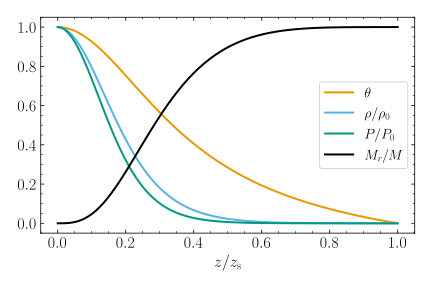
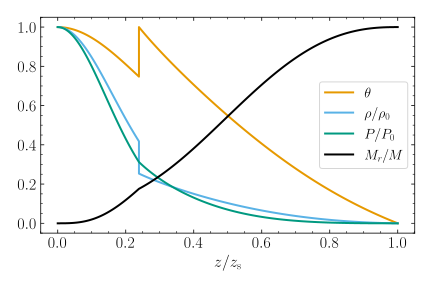

.. _support-tools-build-poly:

build_poly
==========

.. program:: build_poly

Synopsis
--------

.. code-block:: text

   build_poly POLY_FILE [options]

Description
-----------

The :program:`build_poly` tool constructs a :ref:`composite polytrope
<comp-ptrope>`, and writes it to a file in the :ref:`POLY
<poly-file-format>` format.

Options
-------

.. option:: -h, --help

   Print a summary of options.

.. option:: -n, --n_poly=N_POLY[,N_POLY...]

   Polytropic indices :math:`\npoly` (either a single value, or a
   comma-separated list of values, one for each region).

.. option:: -G, --Gamma_1=GAMMA_1

   Adiabatic index :math:`\Gamma_{1}`.

.. option:: -z, --z_b=Z_B[,Z_B...]

   Polytropic coordinate of region boundaries.

.. option:: -D, --Delta_b=DELTA_B[,DELTA_B...]

   Logarithmic density jumps at region boundaries.

.. option:: --theta_s=THETA_S

   Surface polytropic variable value.

.. option:: -d, --dz=DZ

   Grid spacing in polytropic coordinate.

.. option:: -t, --toler=TOLER

   Tolerance of Lane-Emden equation solver.

Examples
--------

To build a simple (complete) polytrope with :math:`\npoly=3`, run :program:`build_poly` as follows:

.. code-block:: console

   $ $GYRE_DIR/bin/build_poly --n_poly=3 --dz=0.01 poly.simple.h5

This model, written to the file :file:`poly.simple.h5`, is visualized in the figure below.

.. _fig-poly-simple:

   Plot of the Lane-Emden solution variable :math:`\theta`, density
   :math:`\rho`, pressure :math:`P` and interior mass :math:`M_{r}` as a
   function of radial coordinate, for the simple
   polytrope. (:download:`Source <fig_poly_simple.py>`)

To build a composite polytrope, comprising two regions (inner
:math:`\npoly=3`, outer :math:`\npoly=1.5`) separated by a density
discontinuity, run :program:`build_poly` as follows:

.. code-block:: console

   $ $GYRE_DIR/bin/build_poly --n_poly=3,1.5 --z_b=1.4 --Delta_b=-0.5 --dz=0.01 poly.composite.h5

This model, written to the file :file:`poly.composite.h5`, is visualized in the figure below.

.. _fig-poly-comp:

   Plot of the Lane-Emden solution variable :math:`\theta`, density
   :math:`\rho`, pressure :math:`P` and interior mass :math:`M_{r}` as a
   function of radial coordinate, for the composite polytrope. Note
   the density discontinuity, and the associated discontinuities in
   the gradients of the pressure and interior mass. (:download:`Source
   <fig_poly_composite.py>`)
