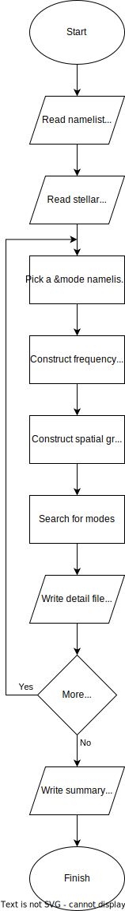

.. _frontends-gyre:

gyre
====

The :program:`gyre` frontend calculates the free-oscillation
modes of a stellar model. The general flow of execution is outlined in
the chart to the right. After reading the :ref:`namelist input file
<namelist-input-files>` and the :ref:`model <stellar-models>`,
:program:`gyre` loops over :nml:group:`mode` namelist groups,
processing each in turn.

For a given group, :program:`gyre` searches over a range of
oscillation frequencies for modes with a specific harmonic degree
:math:`\ell` and azimuthal order :math:`m`. With each mode found, the
eigenfrequency, eigenfunctions and other data are optionally written
to a :ref:`detail file <detail-files>`.  At the end of the run,
response data from all modes found (across all :nml:group:`mode` groups)
are optionally written to a :ref:`summary file <summary-files>`.

The table below lists which namelist groups, and in what number,
should appear in namelist input files for :program:`gyre`.

.. list-table::
   :header-rows: 1
   :widths: 30 30 20

   * - Description
     - Namelist group name
     - Count
   * - :ref:`constants-group`
     - :nml:group:`constants`
     - 1
   * - :ref:`grid-group`
     - :nml:group:`grid`
     - :math:`\geq 1`\ [#last]_
   * - :ref:`mode-group`
     - :nml:group:`mode`
     - :math:`\geq 1`
   * - :ref:`model-group`
     - :nml:group:`model`
     - 1
   * - :ref:`num-group`
     - :nml:group:`num`
     - :math:`\geq 1`\ [#last]_
   * - :ref:`osc-group`
     - :nml:group:`osc`
     - :math:`\geq 1`\ [#last]_
   * - :ref:`output-groups`
     - :nml:group:`ad_output`
     - 1
   * -
     - :nml:group:`nad_output`
     - 1
   * - :ref:`rot-group`
     - :nml:group:`rot`
     - :math:`\geq 1`\ [#last]_
   * - :ref:`scan-group`
     - :nml:group:`scan`
     - :math:`\geq 1`

.. rubric:: Footnotes

.. [#last] While the input file can contain one or more of the
           indicated namelist group, only the last (:ref:`tag-matching
           <working-with-tags>`) one is used.
