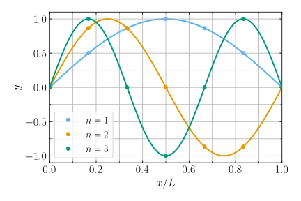

.. _numerical-limits:

Limitations of the Numerical Method
===================================

The numerical method used both in the stretched string problem and in
GYRE generally performs very well; however, it has a couple of failure
scenarios that are important to understand. These scenarios arise
through poor choices of the spatial grid used to discretize the
governing differential equation(s), and/or the frequency grid used to
search for roots of the discriminant function.

Insufficient Spatial Resolution
-------------------------------

The cost of evaluating the determinant of the system matrix
:math:`\mS` scales proportionally to the number of grid points
:math:`N` used for the discretization. Therefore, in the interests of
computational efficiency, we want to make :math:`N` as small as
possible.

However, things go wrong when :math:`N` becomes too
small. :numref:`fig-discrim-func-N7` demonstrates this by plotting the
discriminant function for the stretched-string BVP with
:math:`N=7`. Compared against :numref:`fig-discrim-func`, we see that
toward larger :math:`\sigma` the roots of the discriminant function
become progressively shifted toward lower frequencies; and, above
:math:`\sigma \approx 3.5 \pi c/L`, they disappear altogether.

.. _fig-discrim-func-N7:

.. figure:: fig_discrim_func_N7.svg
   :alt: Plot showing the discriminant function versus frequency
   :align: center

   Plot of the discriminant function :math:`\Dfunc(\sigma)` as a
   function of the frequency :math:`\sigma`, for the stretched-string BVP
   with :math:`N=7`. The orange dots highlight where
   :math:`\Dfunc=0`. The function has been scaled so that
   :math:`\Dfunc(0) = 1`. (:download:`Source
   <fig_discrim_func_N7.py>`)

To understand this behavior, recall that the determinant of an
:math:`N \times N` matrix can be expressed (via :wiki:`Laplace
expansion <Laplace_expansion>`) as the sum of `N` terms; and each term
itself involves the product of :math:`N` matrix elements, picked so
that each row/column is used only once in the construction of the
term. With these points in mind, we can see from the definition
(:eq:`linear-sys`) of :math:`\mS` that its determinant (i.e., the
discriminant function) must be a polynomial in :math:`\sigma^{2}` of
order :math:`N-2`; and as such, it can have at most :math:`N-2` (in
this case, 5) roots. This leads us to important lesson #1:

.. attention::

   The number of points adopted in the discretization limits the
   number of modes that can be found. With a spatial grid of
   :math:`N` points, there are only :math:`\sim N` distinct
   numerical solutions.

.. _fig-eigenfuncs-N7:

   Plot of the eigenfunctions :math:`\tilde{y}` as a function of
   spatial coordinate :math:`x`, for the first three modes of the
   stretched-string BVP with :math:`N=7`. The discrete points show
   the numerical functions, and the solid lines the corresponding
   analytic functions. (:download:`Source <fig_eigenfuncs_N7.py>`)

Returning to :numref:`fig-discrim-func-N7`, the shift in
eigenfrequency for the modes that *are* found occurs due to inadequate
resolution of the eigenfunctions. We can see this in
:numref:`fig-eigenfuncs-N7`, which reprises :numref:`fig-eigenfuncs`
for :math:`N=7`. Clearly, the spatial oscillations of the modes are
poorly resolved; the :math:`n=3` mode, for instance, is sampled with
only one point per quarter wavelength. It's little wonder that the
corresponding eigenfrequencies are off. This brings us to important
lesson #2 (closely related to #1):

.. attention::

   The spatial resolution adopted in the discretization determines the
   accuracy of the modes found. A given eigenfrequency will be
   accurate only when the grid spacing is appreciably smaller than
   the spatial variation scale of its corresponding eigenfunction.

Insufficient Frequency Resolution
---------------------------------

When searching for root brackets, we have to evaluate the discriminant
function a total of :math:`M` times. Therefore, as with the spatial grid,
computational efficiency dictates that we want to make :math:`M` as
small as possible. Again, however, things go wrong if :math:`M` is too
small. :numref:`fig-discrim-brackets-low` reprises
:numref:`fig-discrim-brackets`, but adopting a much coarser frequency
grid with only :math:`M=5` points.

.. _fig-discrim-brackets-low:

.. figure:: fig_discrim_brackets_low.svg
   :alt: Plot showing the discriminant function versus frequency, with root brackets indicated
   :align: center

   Plot of the discriminant values :math:`\{\Dfunc\}` on the discrete
   frequency grid :math:`\{\sigma\}` (distributed uniformly in
   :math:`\sigma`), for the stretched-string BVP with :math:`N=50` and
   :math:`M=5`. The orange-haloed segments highlight adjacent points
   that bracket a root :math:`\Dfunc=0`. (:download:`Source
   <fig_discrim_brackets_low.py>`)

Clearly, a pair of adjacent roots (corresponding to the :math:`n=3`
and :math:`n=4` modes) is missed in the bracketing process, as a
direct result of the too-coarse grid.

Even when many points are included in the frequency grid, issues can
still arise when the distribution of points doesn't match the
distribution of roots. An example of this is provided in
:numref:`fig-discrim-brackets-inv`, which reprises
:numref:`fig-discrim-brackets` with the same number :math:`M=32` of
points in the grid, but now distributed uniformly in
:math:`\sigma^{-1}`.

.. _fig-discrim-brackets-inv:

.. figure:: fig_discrim_brackets_inv.svg
   :alt: Plot showing the discriminant function versus frequency, with root brackets indicated
   :align: center

   Plot of the discriminant values :math:`\{\Dfunc\}` on the discrete
   frequency grid :math:`\{\sigma\}` (distributed uniformly in
   :math:`\sigma^{-1}`), for the stretched-string BVP with :math:`N=50` and
   :math:`M=32`. The orange-haloed segments highlight adjacent points
   that bracket a root :math:`\Dfunc=0`. (:download:`Source
   <fig_discrim_brackets_inv.py>`)

Now it's the roots corresponding to the :math:`n=4` and :math:`n=5`
mode pair that are missed. As with the case in
:numref:`fig-discrim-brackets-low`, the failure ultimately arises
because the spacing between adjacent frequency grid points is (in at
least some parts of the grid) larger than the spacing between adjacent
roots. This can be summarized in important lesson #3:

.. attention::

   The frequency resolution adopted in the root bracketing influences
   the completeness of the modes found. All modes will be found only
   when the grid spacing is smaller than the eigenfrequency separation
   of adjacent modes, across the full range of the grid.
